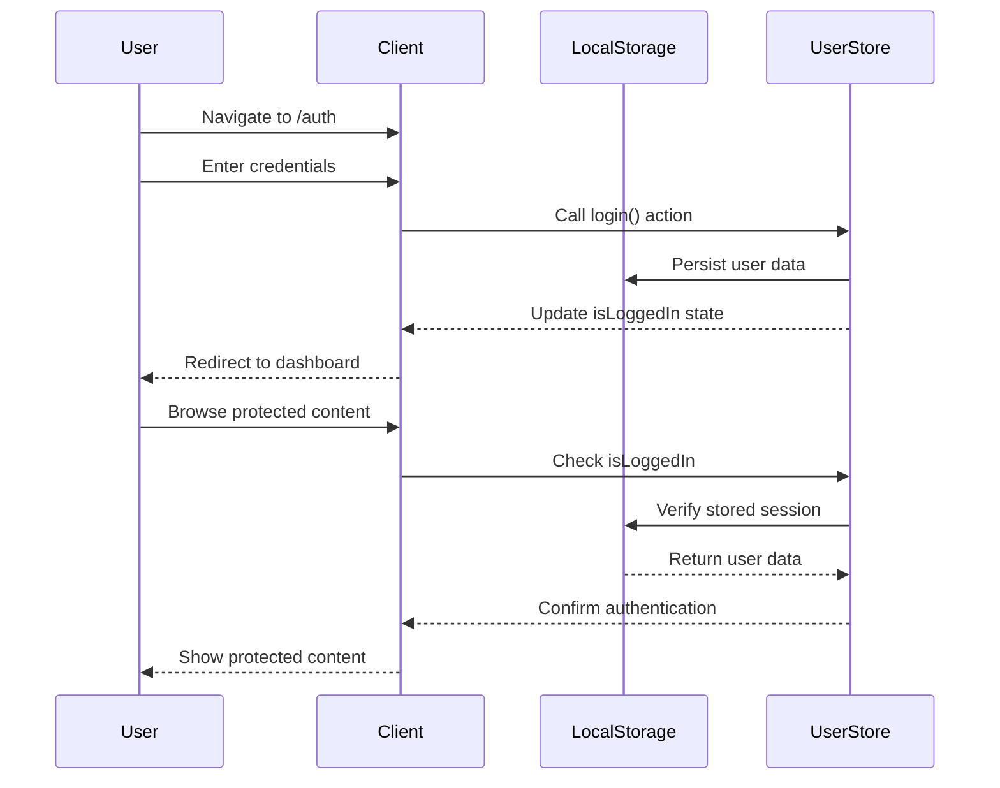
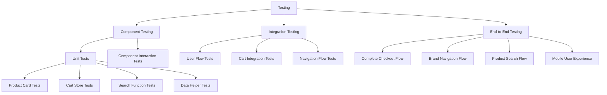

# EGY DEV E-commerce Platform MVP Design Document

## Overview

**EGY DEV** (currently implemented as "MED UNIFORM") is a multi-brand e-commerce platform specializing in medical uniforms and healthcare apparel. The platform serves as a comprehensive marketplace where multiple medical uniform brands operate under a unified shopping experience, targeting healthcare professionals across Egypt and the broader market.

### Project Vision
- **Primary Goal**: Create a modern, responsive marketplace for medical uniform brands targeting healthcare professionals
- **Target Market**: Healthcare workers, medical professionals, and institutions requiring professional medical apparel
- **Business Model**: Multi-brand medical marketplace platform with B2B and B2C capabilities
- **MVP Timeline**: 2 weeks for core functionality
- **Current Status**: MVP implemented with 5 featured brands and comprehensive product catalog

### Key Features
- **Multi-brand product catalog** with medical uniform specialization
- **Brand-specific storefronts** for Healing Hands, Butter-Soft, Med Couture, Dickies Medical, and Easy STRETCH
- **Unified shopping cart and checkout** with persistent state management
- **Responsive mobile-first design** with Tailwind CSS and Shadcn/UI components
- **Advanced search and filtering** capabilities with real-time results
- **User authentication and profiles** with demo account support
- **Promotional banner system** with rotating offers and sales
- **Professional categorization** (scrub tops, pants, lab coats, footwear, accessories)

## Technology Stack & Dependencies

### Core Framework Stack
- **Next.js 14**: App Router architecture for routing and server-side rendering
- **React 18**: Component-based UI development with concurrent features
- **TypeScript**: Type safety and enhanced developer experience
- **Tailwind CSS**: Utility-first styling framework

### UI & Component Libraries
- **Shadcn/UI**: Accessible component primitives built on Radix UI
- **Radix UI**: Headless UI components for accessibility
- **Lucide React**: Modern icon library
- **Class Variance Authority (CVA)**: Type-safe component variants

### State Management & Data
- **Zustand**: Lightweight state management with persistence
- **localStorage**: Client-side data persistence for cart and user sessions
- **Mock Data Layer**: JSON-based data structure for MVP (ready for API integration)

### Development Tools
- **Tailwind Merge**: Utility for merging Tailwind classes
- **ESLint**: Code linting and formatting
- **PostCSS**: CSS processing

## Component Architecture

### Layout Components

#### Header Component Structure
```mermaid
graph TB
    Header --> PromoBanner[Promotional Banner Carousel]
    Header --> TopBar[Top Bar with Location & Contact]
    Header --> MainHeader[Main Header Section]
    Header --> Navigation[Navigation Menu]
    
    MainHeader --> Logo[MED UNIFORM Logo]
    MainHeader --> SearchBar[Search Bar with Autocomplete]
    MainHeader --> UserActions[User Actions]
    
    UserActions --> AuthButtons[Sign In / Create Account]
    UserActions --> CartButton[Cart with Badge]
    UserActions --> MobileMenu[Mobile Menu Toggle]
    
    Navigation --> NavItems[Navigation Items]
    NavItems --> ShopWomen[Shop Women with Dropdown]
    NavItems --> ShopMen[Shop Men with Dropdown]
    NavItems --> Marketplace[Medical Marketplace]
    NavItems --> Sale[Sale (Highlighted)]
```

#### Brand Navigation Implementation
```mermaid
graph TD
    BrandNavigation --> BrandsPage[/brands - All Brands Grid]
    BrandsPage --> BrandCard[Brand Card Components]
    BrandCard --> BrandLogo[Brand Logo Display]
    BrandCard --> BrandInfo[Brand Information]
    BrandCard --> ProductCount[Product Count Badge]
    
    BrandCard --> BrandPage[/brands/[slug] - Individual Brand]
    BrandPage --> BrandHeader[Brand Header Section]
    BrandPage --> BrandProducts[Brand Product Grid]
    
    BrandHeader --> BrandLogo2[Large Brand Logo]
    BrandHeader --> BrandDescription[Brand Description]
    BrandHeader --> BrandStats[Brand Statistics]
```

#### Current Navigation Structure


### Product Components

#### Product Card Component


#### Product Detail Layout


### Brand Components

#### Brand Page Implementation


### Shopping Cart Components

#### Cart State Management


#### Cart Sidebar Implementation


## Data Models & Schema

### Product Schema


### Current Implementation Data Structure
```typescript
// Current Product Interface
interface Product {
  id: string
  name: string
  price: number
  originalPrice?: number
  image: string
  brandId: string
  brand: Brand
  description: string
  inStock: boolean
  category: string
  subCategory?: string
  images?: string[]
  colors?: string[]
  sizes?: string[]
  gender: 'women' | 'men' | 'unisex'
  isOnSale?: boolean
  salePercentage?: number
  isFeatured?: boolean
  tags?: string[]
}

// Current Brand Interface
interface Brand {
  id: string
  name: string
  slug: string
  logo: string
  description?: string
  isPartner?: boolean
  specialOffer?: string
}

// Cart Item Interface
interface CartItem {
  productId: string
  product: Product
  quantity: number
  price: number
  size?: string
  color?: string
}
```

## Routing & Navigation

### App Router Structure


### Navigation Flow Implementation


## Styling Strategy

### Tailwind CSS Configuration


### Design System Implementation
```css
/* Current Color Palette */
:root {
  /* Primary Brand Colors */
  --primary-purple: #8B5CF6;
  --primary-blue: #3B82F6;
  
  /* Medical Brand Colors */
  --healing-hands: #8B5CF6;
  --butter-soft: #F59E0B;
  --med-couture: #EF4444;
  --dickies: #10B981;
  --easy-stretch: #3B82F6;
  
  /* Semantic Colors */
  --success: #10B981;
  --warning: #F59E0B;
  --error: #EF4444;
  --info: #3B82F6;
  
  /* Neutral Grays */
  --gray-50: #F9FAFB;
  --gray-100: #F3F4F6;
  --gray-600: #4B5563;
  --gray-900: #111827;
}

/* Component Styling Patterns */
.header-navigation {
  @apply sticky top-0 z-50 bg-white shadow-sm;
}

.brand-card {
  @apply overflow-hidden hover:shadow-lg transition-all duration-300 group-hover:scale-105;
}

.product-card {
  @apply bg-white rounded-lg shadow-sm hover:shadow-md transition-all duration-200 border hover:border-purple-200;
}

.promotional-banner {
  @apply bg-gradient-to-r text-white px-4 py-2 text-center text-sm font-medium;
}
```

### Component Variants System


## State Management

### Zustand Store Architecture
```mermaid
graph TB
    ZustandStores --> CartStore[Cart Store]
    ZustandStores --> SearchStore[Search Store]
    ZustandStores --> UserStore[User Store]
    
    CartStore --> CartState[Cart State Management]
    CartStore --> CartActions[Cart Actions]
    CartStore --> CartPersistence[localStorage Persistence]
    
    CartState --> Items[items: CartItem[]]
    CartState --> IsOpen[isOpen: boolean]
    CartState --> Getters[Computed Getters]
    
    Getters --> TotalItems[getTotalItems()]
    Getters --> TotalPrice[getTotalPrice()]
    Getters --> ItemQuantity[getItemQuantity()]
    
    CartActions --> AddItem[addItem()]
    CartActions --> RemoveItem[removeItem()]
    CartActions --> UpdateQuantity[updateQuantity()]
    CartActions --> ClearCart[clearCart()]
    CartActions --> ToggleCart[toggleCart()]
    
    SearchStore --> SearchState[Search State]
    SearchState --> Query[query: string]
    SearchState --> IsSearching[isSearching: boolean]
    SearchState --> Results[results: Product[]]
    
    UserStore --> UserState[User State]
    UserState --> User[user: User | null]
    UserState --> IsLoggedIn[isLoggedIn: boolean]
```

### Current Store Implementation
```typescript
// Cart Store Implementation
interface CartStore {
  items: CartItem[]
  isOpen: boolean
  
  // Actions
  addItem: (product: Product, quantity?: number) => void
  removeItem: (productId: string) => void
  updateQuantity: (productId: string, quantity: number) => void
  clearCart: () => void
  toggleCart: () => void
  
  // Getters
  getTotalItems: () => number
  getTotalPrice: () => number
  getItemQuantity: (productId: string) => number
}

// Search Store Implementation
interface SearchStore {
  query: string
  isSearching: boolean
  results: Product[]
  
  setQuery: (query: string) => void
  setResults: (results: Product[]) => void
  setIsSearching: (isSearching: boolean) => void
  clearSearch: () => void
}

// User Store Implementation
interface UserStore {
  user: { id: string; name: string; email: string } | null
  isLoggedIn: boolean
  
  login: (user: { id: string; name: string; email: string }) => void
  logout: () => void
}
```

## API Integration Layer

### Data Fetching Strategy
```mermaid
graph TB
    DataLayer --> MockDataLayer[Mock Data Layer - Current]
    DataLayer --> FutureAPILayer[Future API Layer]
    
    MockDataLayer --> ProductsData[products.json equivalent]
    MockDataLayer --> BrandsData[brands.json equivalent]
    MockDataLayer --> CategoriesData[categories.json equivalent]
    MockDataLayer --> PromoBannersData[promoBanners.json equivalent]
    
    MockDataLayer --> HelperFunctions[Data Helper Functions]
    HelperFunctions --> GetProductById[getProductById()]
    HelperFunctions --> GetBrandBySlug[getBrandBySlug()]
    HelperFunctions --> SearchProducts[searchProducts()]
    HelperFunctions --> GetProductsByBrand[getProductsByBrand()]
    HelperFunctions --> GetSaleProducts[getSaleProducts()]
    HelperFunctions --> GetFeaturedProducts[getFeaturedProducts()]
    
    FutureAPILayer --> ProductsAPI[/api/products]
    FutureAPILayer --> BrandsAPI[/api/brands]
    FutureAPILayer --> OrdersAPI[/api/orders]
    FutureAPILayer --> AuthAPI[/api/auth]
```

### Current Data Helper Functions
```typescript
// Product Helpers
export const getProductById = (id: string): Product | undefined
export const getBrandById = (id: string): Brand | undefined
export const getBrandBySlug = (slug: string): Brand | undefined
export const getProductsByBrand = (brandId: string): Product[]
export const getProductsByBrandSlug = (slug: string): Product[]
export const searchProducts = (query: string): Product[]

// Category Helpers
export const getCategoryById = (id: string): Category | undefined
export const getCategoryBySlug = (slug: string): Category | undefined
export const getProductsByCategory = (categoryId: string): Product[]
export const getProductsByCategorySlug = (slug: string): Product[]
export const getProductsByGender = (gender: 'women' | 'men' | 'unisex'): Product[]

// Featured Content
export const getSaleProducts = (): Product[]
export const getFeaturedProducts = (limit: number = 8): Product[]
export const getPromoBanners = (): PromoBanner[]
```

### Future API Endpoints Structure
```
GET /api/products - List all products with filtering and pagination
GET /api/products/[id] - Get single product details
GET /api/products/search?q=[query] - Search products
GET /api/products/featured - Get featured products
GET /api/products/sale - Get sale products

GET /api/brands - List all brands
GET /api/brands/[slug] - Get brand details
GET /api/brands/[slug]/products - Get products by brand

GET /api/categories - List all categories
GET /api/categories/[slug]/products - Get products by category

POST /api/cart - Add item to cart
PUT /api/cart/[itemId] - Update cart item
DELETE /api/cart/[itemId] - Remove cart item
GET /api/cart - Get cart contents

POST /api/orders - Create new order
GET /api/orders/[id] - Get order details
GET /api/users/[id]/orders - Get user orders

POST /api/auth/login - User login
POST /api/auth/register - User registration
POST /api/auth/logout - User logout
GET /api/auth/me - Get current user
```

## Performance Optimization

### Next.js Performance Features

```mermaid
graph TB
    Performance --> ImageOptimization[Image Optimization]
    Performance --> CodeSplitting[Code Splitting]
    Performance --> StaticGeneration[Static Generation]
    Performance --> Caching[Caching Strategy]
    
    ImageOptimization --> NextImage[next/image Component]
    ImageOptimization --> AutoWebP[Automatic WebP Conversion]
    ImageOptimization --> ResponsiveImages[Responsive Image Loading]
    ImageOptimization --> LazyLoading[Lazy Loading by Default]
    
    CodeSplitting --> DynamicImports[Dynamic Component Imports]
    CodeSplitting --> RouteBasedSplitting[Route-based Code Splitting]
    CodeSplitting --> ComponentLazyLoading[Component Lazy Loading]
    
    StaticGeneration --> StaticPages[Static Page Generation]
    StaticGeneration --> ISR[Incremental Static Regeneration]
    StaticGeneration --> ProductPages[Product Page Optimization]
    
    Caching --> StaticAssets[Static Asset Caching]
    Caching --> APIResponseCaching[API Response Caching]
    Caching --> BrowserCaching[Browser Caching Headers]
```


### Current Performance Implementation
- **Image Optimization**: All product images use Next.js `Image` component with automatic optimization
- **Component Lazy Loading**: Heavy components loaded dynamically when needed
- **State Persistence**: Cart state persisted to localStorage to prevent data loss
- **Search Optimization**: Debounced search to prevent excessive API calls
- **Mobile Performance**: Mobile-first responsive design with optimized touch interactions

## Security & Authentication

### Current Authentication Implementation


### Security Measures Implementation
- **Client-side State Management**: Secure user session handling with Zustand persistence
- **Input Validation**: Form validation for all user inputs
- **XSS Prevention**: React's built-in XSS protection mechanisms
- **CSRF Protection**: Next.js built-in CSRF protection for forms
- **Secure Data Handling**: No sensitive data stored in localStorage (passwords, payment info)
- **Authentication State**: Proper session management with automatic cleanup

## Testing Strategy

### Testing Architecture


### Recommended Testing Tools
- **Jest**: Unit testing framework for JavaScript/TypeScript
- **React Testing Library**: Component testing utilities with accessibility focus
- **Playwright**: End-to-end testing with cross-browser support
- **MSW (Mock Service Worker)**: API mocking for integration tests
- **Storybook**: Component development and visual testing environment

### Key Test Scenarios
1. **Cart Functionality**: Add/remove items, quantity updates, persistence
2. **Product Search**: Search accuracy, filters, performance
3. **Brand Navigation**: Brand page routing, product filtering
4. **Responsive Design**: Mobile navigation, touch interactions
5. **Authentication Flow**: Login/logout, session persistence
6. **Checkout Process**: Form validation, order creation
7. **Performance**: Page load times, image optimization
8. **Accessibility**: Screen reader compatibility, keyboard navigation